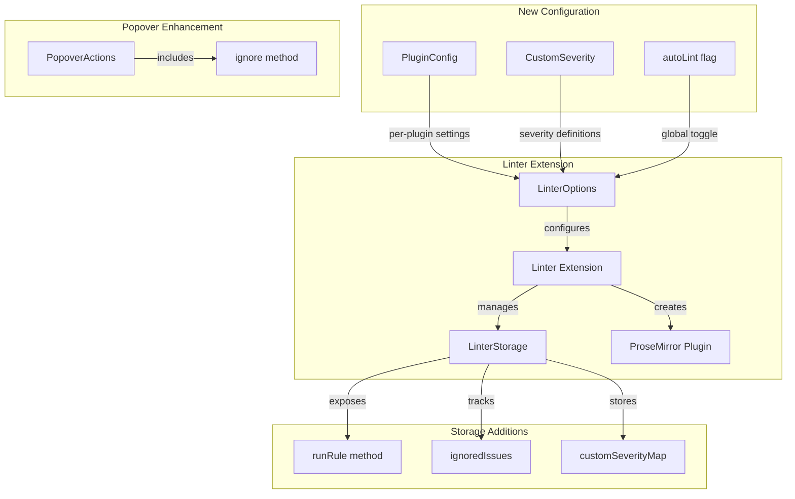

# Design Document: On-Demand Linting

## Overview

This feature extends the Tiptap Linter extension to support on-demand rule execution, configurable automatic linting, per-plugin mode settings, custom severity levels, and issue ignoring. The design maintains backward compatibility while adding new capabilities through optional configuration.

## Architecture

The feature introduces several new concepts to the existing Linter architecture:



## Components and Interfaces

### Extended LinterOptions Interface

```typescript
interface PluginConfig {
    /** The plugin class to use */
    plugin: LinterPluginClass | AsyncLinterPluginClass;
    /** Execution mode: 'auto' runs on document changes, 'onDemand' requires manual trigger */
    mode?: 'auto' | 'onDemand';
}

interface CustomSeverity {
    /** Unique name for the severity level */
    name: string;
    /** CSS color value for highlighting and icons */
    color: string;
}

interface LinterOptions {
    /** Array of plugin classes or plugin configurations */
    plugins: Array<LinterPluginClass | AsyncLinterPluginClass | PluginConfig>;
    /** Popover configuration options */
    popover?: PopoverOptions;
    /** Whether to run plugins automatically on document changes (default: true) */
    autoLint?: boolean;
    /** Custom severity definitions beyond info/warning/error */
    customSeverities?: CustomSeverity[];
}
```

### Extended LinterStorage Interface

```typescript
interface RunRuleOptions {
    /** Whether to apply results as decorations (default: false) */
    applyResults?: boolean;
}

interface IgnoredIssue {
    /** Position in document where issue was ignored */
    from: number;
    to: number;
    /** Issue message to match */
    message: string;
}

interface LinterStorage {
    issues: Issue[];
    getIssues(): Issue[];
    popoverManager: PopoverManager | null;
    asyncDebounceTimer: ReturnType<typeof setTimeout> | null;
    hasScheduledInitialRun: boolean;
    lastDocContentHash: string | null;

    /** Run a specific plugin on-demand and return its issues */
    runRule: (
        pluginClass: LinterPluginClass | AsyncLinterPluginClass,
        options?: RunRuleOptions
    ) => Promise<Issue[]>;

    /** List of ignored issues that won't be displayed */
    ignoredIssues: IgnoredIssue[];

    /** Clear all ignored issues */
    clearIgnoredIssues: () => void;
}
```

### Extended PopoverActions Interface

```typescript
interface PopoverActions {
    applyFix: () => void;
    deleteText: () => void;
    replaceText: (newText: string) => void;
    dismiss: () => void;
    /** Ignore the current issue(s) - removes decoration and prevents re-display */
    ignore: () => void;
}
```

### Extended Severity Type

```typescript
/** Built-in severity levels plus custom string names */
type Severity = 'info' | 'warning' | 'error' | string;
```

## Data Models

### Plugin Configuration Normalization

Plugins can be configured in two ways:

1. Direct class reference (backward compatible): `[BadWords, Punctuation]`
2. Configuration object: `[{ plugin: BadWords, mode: 'auto' }, { plugin: AIGrammar, mode: 'onDemand' }]`

Internal normalization converts all plugins to a unified format:

```typescript
interface NormalizedPlugin {
    pluginClass: LinterPluginClass | AsyncLinterPluginClass;
    mode: 'auto' | 'onDemand';
}
```

### Ignored Issue Matching

Issues are matched for ignoring using a composite key:

-   `from` position
-   `to` position
-   `message` string

This allows the same text at the same position to be re-flagged if the message changes (different rule or updated rule logic).

### Custom Severity CSS Generation

Custom severities generate dynamic CSS classes:

-   `.problem--{name}` for inline highlights
-   `.lint-icon--{name}` for icons

CSS is injected into a `<style>` element in the document head with id `linter-custom-severities`.

## Correctness Properties

_A property is a characteristic or behavior that should hold true across all valid executions of a system-essentially, a formal statement about what the system should do. Properties serve as the bridge between human-readable specifications and machine-verifiable correctness guarantees._

### Property 1: runRule isolation

_For any_ plugin class and document state, calling runRule with applyResults false or omitted SHALL return only issues from that specific plugin and SHALL NOT modify the stored issues array or decorations.
**Validates: Requirements 1.1, 1.4, 3.2**

### Property 2: runRule Promise resolution

_For any_ plugin class (sync or async), calling runRule SHALL return a Promise that resolves with the issues array, awaiting async operations for AILinterPlugin subclasses.
**Validates: Requirements 1.2, 1.3, 2.1, 2.2**

### Property 3: runRule applyResults behavior

_For any_ plugin class and document state, calling runRule with applyResults true SHALL update decorations to show exactly the issues returned by that rule.
**Validates: Requirements 3.1, 3.3**

### Property 4: autoLint disabled behavior

_For any_ document change when autoLint is false, the stored issues array and decorations SHALL remain unchanged, but runRule SHALL still function.
**Validates: Requirements 6.1, 6.2, 6.3**

### Property 5: Plugin mode filtering

_For any_ set of plugins with mixed modes, automatic linting SHALL only execute plugins with mode 'auto' or undefined, while runRule SHALL execute any plugin regardless of mode.
**Validates: Requirements 7.1, 7.2, 7.3, 7.4**

### Property 6: Custom severity CSS generation

_For any_ custom severity definition with name and color, the Linter SHALL generate CSS classes `.problem--{name}` and `.lint-icon--{name}` using the specified color.
**Validates: Requirements 8.2, 8.3, 8.4**

### Property 7: Custom severity fallback

_For any_ issue with an unregistered severity name, the Linter SHALL apply the default warning styling.
**Validates: Requirements 8.5**

### Property 8: Ignored issue filtering

_For any_ issue that matches an entry in ignoredIssues by position (from, to) and message, that issue SHALL NOT appear in the decorations after re-linting.
**Validates: Requirements 9.3, 9.4**

### Property 9: Ignore action storage update

_For any_ issue, calling the ignore action SHALL add an entry to ignoredIssues with matching from, to, and message values, and remove the decoration immediately.
**Validates: Requirements 9.2, 9.3**

### Property 10: Error propagation

_For any_ plugin that throws (sync) or rejects (async) during runRule execution, the returned Promise SHALL reject with the error.
**Validates: Requirements 5.1, 5.2**

### Property 11: Invalid issue filtering

_For any_ plugin that produces issues with invalid positions (negative, out of bounds, from >= to), those issues SHALL be filtered out from the returned array.
**Validates: Requirements 5.3**

## Error Handling

### Invalid Plugin Class

When `runRule` is called with an invalid plugin class (not a function or doesn't have expected methods), the Promise rejects with a descriptive error:

```typescript
throw new Error(
    'Invalid plugin class: must be a LinterPlugin or AILinterPlugin subclass'
);
```

### Plugin Execution Errors

-   Sync plugin errors: Promise rejects with the thrown error
-   Async plugin errors: Promise rejects with the rejection reason
-   Invalid issues (missing required fields, out-of-bounds positions): Filtered out silently

### Unregistered Custom Severity

When an issue uses a severity name not in customSeverities and not a built-in severity, the warning styling is applied as fallback.

## Testing Strategy

### Property-Based Testing Library

Use `fast-check` for property-based testing, consistent with existing tests in the codebase.

### Unit Tests

-   Configuration parsing and normalization
-   CSS generation for custom severities
-   Ignored issue matching logic
-   Error handling paths

### Property-Based Tests

Each correctness property will have a corresponding property-based test:

-   Generate random documents and plugin configurations
-   Verify invariants hold across all generated inputs
-   Test edge cases through shrinking

Test annotations will follow the format:

```typescript
// **Feature: on-demand-linting, Property 1: runRule isolation**
// **Validates: Requirements 1.1, 1.4**
```

### Integration Tests

-   Full flow: configure linter → run rule → verify results
-   Popover ignore action → verify issue removed
-   Custom severity → verify CSS applied
