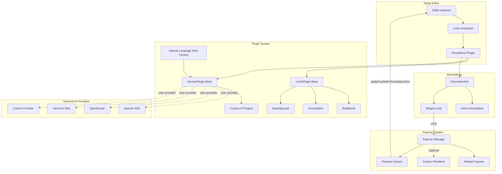

# Design Document: Tiptap Linter Extension

## Overview

This design describes an improved Tiptap/ProseMirror linter extension that provides:

1. A core `Linter` Tiptap extension that manages plugin execution, decorations, and user interactions
2. A typed `LinterPlugin` base class for creating sync lint rules
3. An `AILinterPlugin` base class for async AI-powered lint rules
4. A `createNaturalLanguageRule` factory for plain English lint rules
5. Built-in plugins: `BadWords`, `Punctuation`, `HeadingLevel`
6. A Vue demo component showcasing the linter

The architecture prioritizes:

-   Type safety with proper TypeScript interfaces
-   Correctness (all regex matches found, not just first)
-   Extensibility (bring your own AI SDK)
-   Clean separation between sync and async plugins

## Architecture



## Components and Interfaces

### Core Types

```typescript
// Severity levels for issues
export type Severity = 'info' | 'warning' | 'error';

// Fix function signature
export type FixFn = (view: EditorView, issue: Issue) => void;

// Core issue interface
export interface Issue {
    message: string;
    from: number;
    to: number;
    severity: Severity;
    fix?: FixFn;
}

// Plugin constructor type
export type LinterPluginClass = new (doc: ProsemirrorNode) => LinterPlugin;

// Async plugin constructor type
export type AsyncLinterPluginClass = new (
    doc: ProsemirrorNode
) => AILinterPlugin;
```

### LinterPlugin Base Class

```typescript
export class LinterPlugin {
    protected doc: ProsemirrorNode;
    private results: Issue[] = [];

    constructor(doc: ProsemirrorNode) {
        this.doc = doc;
    }

    // Record an issue with default warning severity
    protected record(
        message: string,
        from: number,
        to: number,
        severity: Severity = 'warning',
        fix?: FixFn
    ): void {
        this.results.push({ message, from, to, severity, fix });
    }

    // Override in subclasses - sync scan
    scan(): this | Promise<this> {
        return this;
    }

    getResults(): Issue[] {
        return this.results;
    }
}
```

### AILinterPlugin Base Class

```typescript
export interface AIProviderFn {
    (prompt: string, content: string): Promise<AIResponse>;
}

export interface AIResponse {
    issues: Array<{
        message: string;
        textMatch: string; // The problematic text to find
        suggestion?: string; // Optional replacement text
    }>;
}

export interface AILinterPluginConfig {
    provider: AIProviderFn;
    systemPrompt?: string;
    debounceMs?: number;
    severity?: Severity;
}

export abstract class AILinterPlugin extends LinterPlugin {
    protected config: AILinterPluginConfig;

    constructor(doc: ProsemirrorNode, config: AILinterPluginConfig) {
        super(doc);
        this.config = config;
    }

    // Extract plain text with position mapping
    protected extractTextWithPositions(): {
        text: string;
        positionMap: Map<number, number>;
    } {
        // Returns document text and maps text offsets to ProseMirror positions
    }

    // Convert AI response to issues
    protected parseAIResponse(
        response: AIResponse,
        positionMap: Map<number, number>
    ): void {
        // Finds text matches in document and records issues at correct positions
    }

    // Create fix function from replacement text
    protected createTextFix(replacement: string): FixFn {
        return (view, issue) => {
            view.dispatch(
                view.state.tr.replaceWith(
                    issue.from,
                    issue.to,
                    view.state.schema.text(replacement)
                )
            );
        };
    }

    abstract scan(): Promise<this>;
}
```

### Natural Language Rule Factory

```typescript
export interface NaturalLanguageRuleConfig {
    rule: string; // Plain English rule description
    provider: AIProviderFn; // User's AI provider function
    severity?: Severity; // Default: 'warning'
    debounceMs?: number; // Default: 500
}

export function createNaturalLanguageRule(
    config: NaturalLanguageRuleConfig
): AsyncLinterPluginClass {
    // Returns a class that extends AILinterPlugin
    // Uses a system prompt that instructs AI to find violations
    // of the natural language rule
}
```

### Linter Extension

```typescript
export interface LinterOptions {
    plugins: Array<LinterPluginClass | AsyncLinterPluginClass>;
}

export interface LinterStorage {
    issues: Issue[];
    getIssues(): Issue[];
}

export const Linter = Extension.create<LinterOptions, LinterStorage>({
    name: 'linter',

    addOptions() {
        return { plugins: [] };
    },

    addStorage() {
        return {
            issues: [],
            getIssues() {
                return this.issues;
            },
        };
    },

    addProseMirrorPlugins() {
        // Returns ProseMirror plugin that:
        // - Runs all plugins (sync and async) on doc changes
        // - Creates DecorationSet from issues
        // - Handles click/double-click on icons
        // - Updates storage with current issues
    },
});
```

### Icon Rendering

```typescript
interface IconDivElement extends HTMLDivElement {
    issue?: Issue;
}

function renderIcon(issue: Issue): IconDivElement {
    const icon = document.createElement('div') as IconDivElement;
    icon.className = `lint-icon lint-icon--${issue.severity}`;
    icon.title = issue.message;
    icon.issue = issue;
    icon.setAttribute('role', 'button');
    icon.setAttribute('aria-label', `Lint issue: ${issue.message}`);
    return icon;
}
```

### Popover System

The popover system provides a customizable UI for displaying issue details and actions when clicking lint icons.

```typescript
/**
 * Actions available to popover renderers for interacting with issues
 */
export interface PopoverActions {
    /** Apply the issue's fix function (if available) and close popover */
    applyFix: () => void;
    /** Delete the text in the issue range and close popover */
    deleteText: () => void;
    /** Replace the issue range with custom text and close popover */
    replaceText: (newText: string) => void;
    /** Close the popover without making changes */
    dismiss: () => void;
}

/**
 * Context passed to custom popover renderers
 */
export interface PopoverContext {
    /** The issue(s) at this position */
    issues: Issue[];
    /** Available actions for the popover */
    actions: PopoverActions;
    /** The EditorView instance */
    view: EditorView;
}

/**
 * Custom popover renderer function type
 * Returns an HTMLElement to display in the popover
 */
export type PopoverRenderer = (context: PopoverContext) => HTMLElement;

/**
 * Popover positioning options
 */
export type PopoverPlacement = 'top' | 'bottom' | 'left' | 'right';

/**
 * Popover styling configuration
 */
export interface PopoverStyle {
    /** CSS border property */
    border?: string;
    /** CSS background property */
    background?: string;
    /** CSS padding property */
    padding?: string;
    /** CSS border-radius property */
    borderRadius?: string;
    /** CSS box-shadow property */
    boxShadow?: string;
    /** Offset from the icon in pixels */
    offset?: number;
}

/**
 * Popover configuration options
 */
export interface PopoverOptions {
    /** Custom renderer function (optional - uses default if not provided) */
    renderer?: PopoverRenderer;
    /** Popover placement relative to icon */
    placement?: PopoverPlacement;
    /** Custom styling */
    style?: PopoverStyle;
    /** Whether to show severity indicator */
    showSeverity?: boolean;
    /** Whether to show fix button when available */
    showFixButton?: boolean;
}

/**
 * Extended Linter options with popover configuration
 */
export interface LinterOptions {
    plugins: Array<LinterPluginClass | AsyncLinterPluginClass>;
    popover?: PopoverOptions;
}
```

#### Default Popover Implementation

```typescript
function createDefaultPopover(context: PopoverContext): HTMLElement {
    const container = document.createElement('div');
    container.className = 'lint-popover';

    for (const issue of context.issues) {
        const issueEl = document.createElement('div');
        issueEl.className = `lint-popover__issue lint-popover__issue--${issue.severity}`;

        // Severity badge
        const badge = document.createElement('span');
        badge.className = 'lint-popover__severity';
        badge.textContent = issue.severity;
        issueEl.appendChild(badge);

        // Message
        const message = document.createElement('p');
        message.className = 'lint-popover__message';
        message.textContent = issue.message;
        issueEl.appendChild(message);

        // Actions
        const actions = document.createElement('div');
        actions.className = 'lint-popover__actions';

        if (issue.fix) {
            const fixBtn = document.createElement('button');
            fixBtn.className = 'lint-popover__btn lint-popover__btn--fix';
            fixBtn.textContent = 'Fix';
            fixBtn.onclick = () => context.actions.applyFix();
            actions.appendChild(fixBtn);
        }

        const dismissBtn = document.createElement('button');
        dismissBtn.className = 'lint-popover__btn lint-popover__btn--dismiss';
        dismissBtn.textContent = 'Dismiss';
        dismissBtn.onclick = () => context.actions.dismiss();
        actions.appendChild(dismissBtn);

        issueEl.appendChild(actions);
        container.appendChild(issueEl);
    }

    return container;
}
```

#### Popover Manager

```typescript
class PopoverManager {
    private popoverEl: HTMLElement | null = null;
    private view: EditorView;
    private options: PopoverOptions;

    constructor(view: EditorView, options: PopoverOptions = {}) {
        this.view = view;
        this.options = options;
    }

    show(issues: Issue[], anchorEl: HTMLElement): void {
        this.hide(); // Close any existing popover

        const actions: PopoverActions = {
            applyFix: () => {
                const issue = issues.find((i) => i.fix);
                if (issue?.fix) {
                    issue.fix(this.view, issue);
                    this.view.focus();
                }
                this.hide();
            },
            deleteText: () => {
                const issue = issues[0];
                if (issue) {
                    this.view.dispatch(
                        this.view.state.tr.delete(issue.from, issue.to)
                    );
                    this.view.focus();
                }
                this.hide();
            },
            replaceText: (newText: string) => {
                const issue = issues[0];
                if (issue) {
                    this.view.dispatch(
                        this.view.state.tr.replaceWith(
                            issue.from,
                            issue.to,
                            this.view.state.schema.text(newText)
                        )
                    );
                    this.view.focus();
                }
                this.hide();
            },
            dismiss: () => this.hide(),
        };

        const context: PopoverContext = {
            issues,
            actions,
            view: this.view,
        };

        const renderer = this.options.renderer ?? createDefaultPopover;
        this.popoverEl = renderer(context);
        this.popoverEl.classList.add('lint-popover-container');

        // Apply custom styles
        if (this.options.style) {
            Object.assign(this.popoverEl.style, this.options.style);
        }

        // Position relative to anchor
        document.body.appendChild(this.popoverEl);
        this.positionPopover(anchorEl);

        // Setup close handlers
        this.setupCloseHandlers();
    }

    hide(): void {
        if (this.popoverEl) {
            this.popoverEl.remove();
            this.popoverEl = null;
        }
    }

    private positionPopover(anchorEl: HTMLElement): void {
        // Position calculation based on placement option
    }

    private setupCloseHandlers(): void {
        // Click outside and Escape key handlers
    }
}
```

## Data Models

### Issue Flow


### Async Plugin Flow


### Position Mapping

For AI plugins, we need to map plain text offsets back to ProseMirror positions:

```typescript
interface TextSegment {
    text: string;
    from: number; // ProseMirror position
    to: number; // ProseMirror position
}

// Build position map by walking document
function buildPositionMap(doc: ProsemirrorNode): {
    fullText: string;
    segments: TextSegment[];
} {
    const segments: TextSegment[] = [];
    let fullText = '';

    doc.descendants((node, pos) => {
        if (node.isText && node.text) {
            segments.push({
                text: node.text,
                from: pos,
                to: pos + node.text.length,
            });
            fullText += node.text;
        } else if (node.isBlock && segments.length > 0) {
            fullText += '\n'; // Preserve block boundaries
        }
    });

    return { fullText, segments };
}
```

## Correctness Properties

_A property is a characteristic or behavior that should hold true across all valid executions of a system-essentially, a formal statement about what the system should do. Properties serve as the bridge between human-readable specifications and machine-verifiable correctness guarantees._

Based on the acceptance criteria analysis, the following properties must hold:

### Property 1: Regex All-Matches Detection

_For any_ text node containing N matches of a regex pattern, the plugin SHALL record exactly N issues, one for each match.

This is critical for correctness - the original implementation only found the first match per node due to not looping over `regex.exec()`. We must reset `lastIndex` and iterate until no more matches.

**Validates: Requirements 4.1, 4.3, 5.3, 6.4**

### Property 2: Record/GetResults Round-Trip

_For any_ sequence of `record()` calls with messages M1..Mn, positions P1..Pn, and severities S1..Sn, calling `getResults()` SHALL return exactly n Issue objects with matching data.

**Validates: Requirements 3.3, 3.4**

### Property 3: Decoration Severity Class Consistency

_For any_ Issue with severity S, the generated inline decoration SHALL have CSS class `problem problem--{S}` and the widget decoration SHALL have CSS class `lint-icon lint-icon--{S}`.

**Validates: Requirements 1.4, 9.1, 9.2**

### Property 4: Storage Issues Synchronization

_For any_ set of issues I computed by plugins, after decoration creation, `storage.getIssues()` SHALL return an array equal to I.

**Validates: Requirements 10.2, 10.3**

### Property 5: DecorationSet Reuse on Non-Doc Transactions

_For any_ transaction T where `T.docChanged === false`, the plugin's `apply()` SHALL return the same DecorationSet reference as the previous state.

**Validates: Requirements 1.3**

### Property 6: DecorationSet Rebuild on Doc Changes

_For any_ transaction T where `T.docChanged === true`, the plugin's `apply()` SHALL return a new DecorationSet computed from the updated document.

**Validates: Requirements 1.2**

### Property 7: BadWords Detection with Message

_For any_ text containing a word W from the bad words list, the BadWords plugin SHALL record an issue where the message contains W.

**Validates: Requirements 5.1, 5.2**

### Property 8: Punctuation Fix Round-Trip

_For any_ text with suspicious punctuation spacing (space before punctuation), after applying the fix function, the text SHALL have the punctuation followed by exactly one space with no space before.

**Validates: Requirements 6.1, 6.2, 6.3**

### Property 9: HeadingLevel Detection

_For any_ document with heading sequence H1, H2, ..., Hn where Hi+1.level > Hi.level + 1, the HeadingLevel plugin SHALL record an issue for Hi+1.

**Validates: Requirements 7.2**

### Property 10: HeadingLevel Fix Round-Trip

_For any_ heading issue with fix function, after applying the fix, the heading level SHALL equal the previous heading level + 1.

**Validates: Requirements 7.3, 7.4**

### Property 11: Async Plugin Awaiting

_For any_ async plugin returning Promise<this>, the linter SHALL await the promise and include the plugin's issues in the final DecorationSet.

**Validates: Requirements 12.1**

### Property 12: Async Plugin Error Isolation

_For any_ set of plugins where one throws an error, the linter SHALL still collect issues from all non-failing plugins.

**Validates: Requirements 12.4**

### Property 13: AI Text Extraction Position Mapping

_For any_ document D, extracting text and building a position map, then looking up a text substring S, SHALL return the correct ProseMirror `from` and `to` positions where S appears in D.

**Validates: Requirements 13.2, 15.2**

### Property 14: AI Response to Issue Conversion

_For any_ valid AIResponse with issues containing textMatch strings that exist in the document, `parseAIResponse()` SHALL record Issue objects with correct positions.

**Validates: Requirements 13.3, 15.1, 16.3**

### Property 15: AI Fix Function Creation

_For any_ AI suggestion with replacement text R, the created fix function SHALL replace the issue range with R when invoked.

**Validates: Requirements 15.3, 16.4**

### Property 16: AI Response Malformed Handling

_For any_ malformed AIResponse (missing fields, invalid structure), `parseAIResponse()` SHALL not throw and SHALL record zero issues.

**Validates: Requirements 15.4**

### Property 17: Natural Language Rule Factory Output

_For any_ call to `createNaturalLanguageRule({ rule: R, provider: P })`, the returned class SHALL be a valid AsyncLinterPluginClass that can be instantiated and scanned.

**Validates: Requirements 17.1**

### Property 18: Natural Language Rule Provider Invocation

_For any_ natural language rule with rule text R scanning document D, the provider function SHALL be called with a prompt containing R and content from D.

**Validates: Requirements 16.2, 17.5**

### Property 19: Multiple Natural Language Rules Aggregation

_For any_ configuration with N natural language rules, each returning M issues, the final issue list SHALL contain N\*M issues (assuming no duplicates).

**Validates: Requirements 16.5**

### Property 20: Default Severity

_For any_ call to `record()` without a severity parameter, the resulting Issue SHALL have severity 'warning'.

**Validates: Requirements 2.4**

### Property 21: Popover Opens on Icon Click

_For any_ lint icon click event, the popover manager SHALL display a popover containing the associated issue(s).

**Validates: Requirements 8.1, 8.2**

### Property 22: Popover Actions Modify Document Correctly

_For any_ popover action (applyFix, deleteText, replaceText), the action SHALL modify the document at the correct position range and close the popover.

**Validates: Requirements 19.1, 19.2, 19.3**

### Property 23: Popover Dismiss Closes Without Changes

_For any_ dismiss action or click-outside/Escape event, the popover SHALL close without modifying the document.

**Validates: Requirements 8.4, 19.4**

### Property 24: Custom Popover Renderer Receives Correct Context

_For any_ custom popover renderer, the renderer SHALL receive a PopoverContext with the correct issues array and functional action callbacks.

**Validates: Requirements 18.2, 18.3**

## Error Handling

### Sync Plugin Errors

```typescript
function runSyncPlugins(
    doc: ProsemirrorNode,
    plugins: LinterPluginClass[]
): Issue[] {
    const issues: Issue[] = [];

    for (const PluginClass of plugins) {
        try {
            const plugin = new PluginClass(doc);
            const result = plugin.scan();

            // Handle both sync and async returns
            if (result instanceof Promise) {
                // Skip - will be handled by async runner
                continue;
            }

            issues.push(...plugin.getResults());
        } catch (error) {
            console.error(`Linter plugin ${PluginClass.name} failed:`, error);
            // Continue with other plugins
        }
    }

    return issues;
}
```

### Async Plugin Errors

```typescript
async function runAsyncPlugins(
    doc: ProsemirrorNode,
    plugins: AsyncLinterPluginClass[]
): Promise<Issue[]> {
    const results = await Promise.allSettled(
        plugins.map(async (PluginClass) => {
            const plugin = new PluginClass(doc);
            await plugin.scan();
            return plugin.getResults();
        })
    );

    return results
        .filter(
            (r): r is PromiseFulfilledResult<Issue[]> =>
                r.status === 'fulfilled'
        )
        .flatMap((r) => r.value);
}
```

### AI Response Parsing Errors

```typescript
protected parseAIResponse(response: unknown): void {
  try {
    if (!response || typeof response !== 'object') return

    const typed = response as Partial<AIResponse>
    if (!Array.isArray(typed.issues)) return

    for (const issue of typed.issues) {
      if (!issue.message || !issue.textMatch) continue

      const position = this.findTextPosition(issue.textMatch)
      if (!position) continue

      const fix = issue.suggestion
        ? this.createTextFix(issue.suggestion)
        : undefined

      this.record(
        issue.message,
        position.from,
        position.to,
        this.config.severity ?? 'warning',
        fix
      )
    }
  } catch (error) {
    console.error('Failed to parse AI response:', error)
    // Silently fail - no issues recorded
  }
}
```

## Testing Strategy

### Property-Based Testing Library

We will use **fast-check** for property-based testing in TypeScript/JavaScript.

Configuration: Each property test runs a minimum of 100 iterations.

### Test File Structure

```
src/
├── extension/
│   ├── Linter.ts
│   ├── Linter.test.ts           # Unit tests
│   ├── Linter.property.test.ts  # Property tests
│   ├── LinterPlugin.ts
│   ├── LinterPlugin.test.ts
│   ├── LinterPlugin.property.test.ts
│   ├── AILinterPlugin.ts
│   ├── AILinterPlugin.test.ts
│   ├── AILinterPlugin.property.test.ts
│   └── plugins/
│       ├── BadWords.ts
│       ├── BadWords.property.test.ts
│       ├── Punctuation.ts
│       ├── Punctuation.property.test.ts
│       ├── HeadingLevel.ts
│       └── HeadingLevel.property.test.ts
├── factory/
│   ├── createNaturalLanguageRule.ts
│   └── createNaturalLanguageRule.property.test.ts
└── demo/
    └── LinterDemo.vue
```

### Property Test Annotations

Each property-based test MUST be tagged with a comment referencing the design document:

```typescript
// **Feature: tiptap-linter, Property 1: Regex All-Matches Detection**
test.prop([fc.string(), fc.integer({ min: 1, max: 5 })])(
    'finds all regex matches in text node',
    (baseText, matchCount) => {
        // ... test implementation
    }
);
```

### Unit Tests

Unit tests cover:

-   Specific examples demonstrating correct behavior
-   Edge cases (empty documents, single character text, etc.)
-   Integration between components
-   Click/double-click event handling (DOM simulation)

### Test Generators

For property tests, we need smart generators:

```typescript
// Generate ProseMirror-like document structure
const docGenerator = fc.record({
    type: fc.constant('doc'),
    content: fc.array(
        fc.oneof(
            // Paragraph with text
            fc.record({
                type: fc.constant('paragraph'),
                content: fc.array(
                    fc.record({
                        type: fc.constant('text'),
                        text: fc.string({ minLength: 1 }),
                    })
                ),
            }),
            // Heading
            fc.record({
                type: fc.constant('heading'),
                attrs: fc.record({ level: fc.integer({ min: 1, max: 6 }) }),
                content: fc.array(
                    fc.record({
                        type: fc.constant('text'),
                        text: fc.string({ minLength: 1 }),
                    })
                ),
            })
        )
    ),
});

// Generate text with N bad words
const textWithBadWords = (count: number) =>
    fc
        .array(
            fc.oneof(
                fc.constantFrom('obviously', 'clearly', 'evidently', 'simply'),
                fc
                    .string({ minLength: 1 })
                    .filter(
                        (s) =>
                            ![
                                'obviously',
                                'clearly',
                                'evidently',
                                'simply',
                            ].includes(s.toLowerCase())
                    )
            ),
            { minLength: count, maxLength: count + 10 }
        )
        .map((words) => words.join(' '));

// Generate AI response
const aiResponseGenerator = fc.record({
    issues: fc.array(
        fc.record({
            message: fc.string({ minLength: 1 }),
            textMatch: fc.string({ minLength: 1 }),
            suggestion: fc.option(fc.string()),
        })
    ),
});
```

### Dual Testing Approach

Both unit tests and property tests are required:

1. **Unit tests** catch specific bugs and verify edge cases
2. **Property tests** verify universal properties across all inputs

Together they provide comprehensive coverage.
